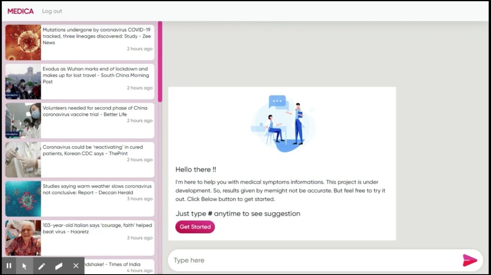

# Medica _- a healthcare chatbot web app_

## Tech Stack
    1. Angular 9
    2. Firebase

### Setup
1. ```npm i```
2. Create a app on Firebase and add configuration to ```src/environments/environment.ts```. See ```environment.demo.ts```

### Output

[](media/Medica.gif)
